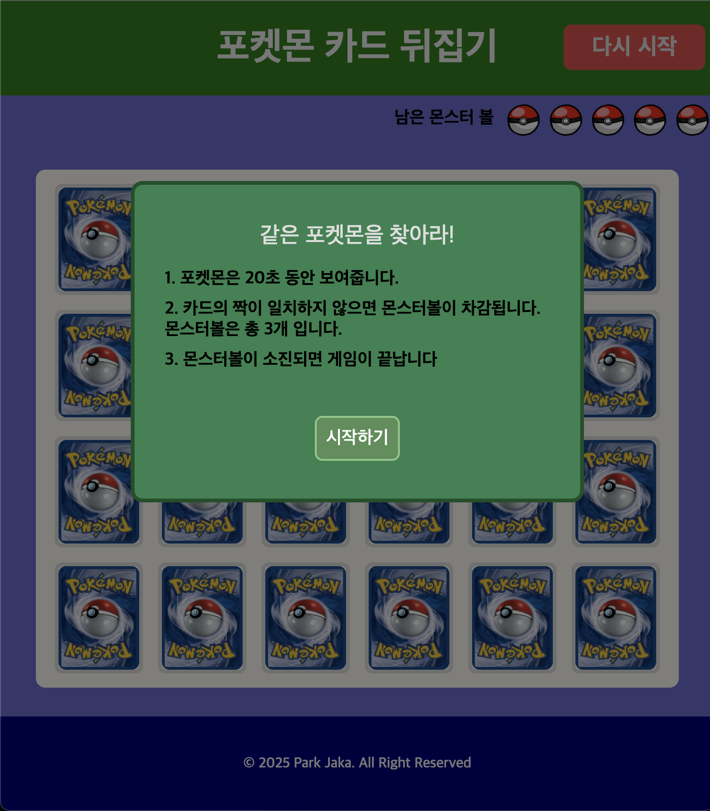
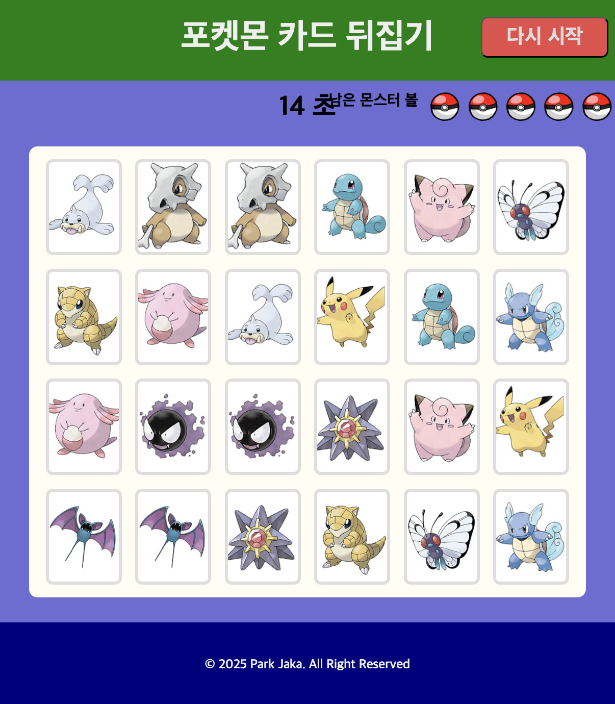
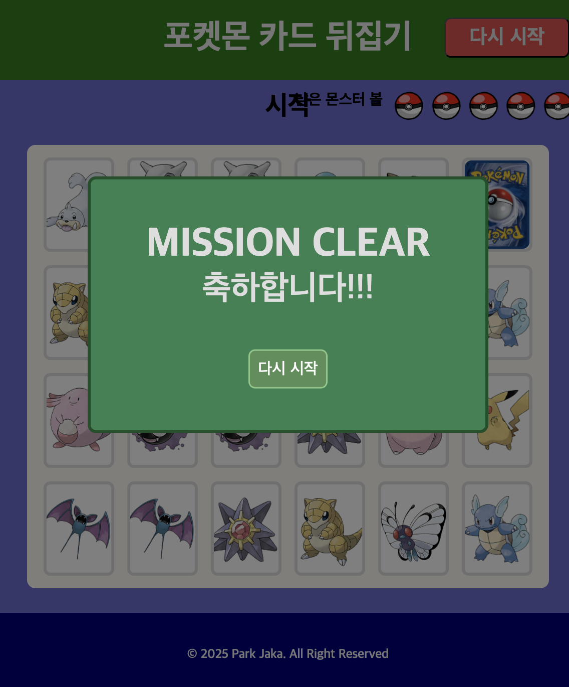

# Pokémon Card Matching Game

HTML, CSS, Vanilla JavaScript로 구현한 같은 그림 맞추기 카드 게임입니다.

게임이 시작되면 무작위로 배치된 12쌍의 포켓몬 카드를 일정 시간 동안 보여줍니다.  
카드가 다시 뒤집힌 이후에는 두 장씩 선택하여 같은 포켓몬 카드인지 확인합니다.

라이브러리나 프레임워크를 사용하지 않고 DOM 조작, 이벤트 처리, 배열 랜덤 배치, 객체 상태 관리를 직접 구현했습니다.

---

## Demo

- 배포 주소: `https://interclear94.github.io/memory_game/`
- GitHub: `https://github.com/interclear94/memory_game`

---

## Preview

<!-- 프로젝트 화면 캡처 이미지로 교체 -->

```md



```

---

## Tech Stack

- HTML5
- CSS3
- Vanilla JavaScript

---

## 주요 기능

### 1. 카드 랜덤 배치

26개의 포켓몬 이미지 중 12개를 중복 없이 선택합니다.

선택된 이미지마다 같은 카드를 두 장씩 생성한 뒤, 총 24개의 카드 위치에 무작위로 배치합니다.

```js
const randomCard = Math.floor(Math.random() * totalCardBox.length);
const randomPicked = totalCardBox.splice(randomCard, 1);
```

`splice()`를 사용해 이미 선택된 카드 번호를 원본 배열에서 제거하여 같은 이미지가 다시 선택되지 않도록 처리했습니다.
카드 위치 역시 사용된 인덱스를 배열에서 제거하여 하나의 위치에 여러 카드가 배치되지 않도록 구현했습니다.

---

### 2. 카드 객체 상태 관리

각 카드의 정보와 상태를 `CreateCard` 생성자 함수로 관리했습니다.

```js
function CreateCard(cardNumber, position) {
  this.cardNumber = cardNumber;
  this.position = position;
  this.flippedState = false;
  this.pairingState = false;
}
```

각 카드 객체는 다음 정보를 가집니다.

| 속성           | 설명                             |
| -------------- | -------------------------------- |
| `cardNumber`   | 카드에 표시할 포켓몬 이미지 번호 |
| `position`     | 카드가 배치된 위치               |
| `flippedState` | 카드가 현재 뒤집혀 있는지 여부   |
| `pairingState` | 카드의 짝을 맞췄는지 여부        |

카드 상태를 변경하는 메서드도 객체 내부에 정의했습니다.

```js
this.doFlipCard = function () {
  this.flippedState = true;
};

this.doPairedCard = function () {
  this.pairingState = true;
};

this.rewind = function () {
  this.flippedState = false;
};
```

---

### 3. 카드 DOM 동적 생성

게임 시작 시 JavaScript를 사용해 카드에 필요한 DOM 요소를 동적으로 생성합니다.
각 카드는 다음과 같은 구조로 구성됩니다.

```html
<li>
  <div class="card_inner">
    <div class="card_front">
      
    </div>

    <div class="card_back">
      
    </div>
  </div>
</li>
```

게임을 다시 시작할 때 기존 카드 목록을 비운 뒤 새로운 카드 조합을 생성합니다.

```js
cardUl.innerHTML = "";
render();
```

---

### 4. 카드 뒤집기 애니메이션

CSS의 `transform: rotateY()`를 사용해 카드를 뒤집는 효과를 구현했습니다.

```js
cardBack.style.transform = "rotateY(180deg)";
```

카드를 선택하면 앞면을 보여주고, 서로 다른 카드라면 일정 시간이 지난 뒤 다시 뒷면으로 되돌립니다.

```js
setTimeout(() => {
  cardBack[pickedIndex1].style.transform = "rotateY(0deg)";
  cardBack[pickedIndex2].style.transform = "rotateY(0deg)";
}, 500);
```

---

### 5. 두 카드 비교

사용자가 첫 번째 카드를 선택하면 카드 번호와 DOM 요소를 저장합니다.
두 번째 카드가 선택되면 첫 번째 카드와 `data-card-number` 값을 비교합니다.

```js
if (oneCardNumber === theOtherCardNumber) {
  // 같은 카드
} else {
  // 다른 카드
}
```

같은 카드인 경우:

- 두 카드의 `pairingState`를 `true`로 변경
- 해당 카드의 추가 클릭 차단
- 모든 카드가 맞춰졌는지 확인

다른 카드인 경우:

- 일정 시간 후 두 카드를 다시 뒤집음
- 카드 클릭을 다시 활성화
- 남은 기회 차감

---

### 6. 같은 카드 중복 선택 방지

첫 번째로 선택한 카드는 두 번째 카드 선택이 완료될 때까지 클릭할 수 없도록 처리했습니다.

```js
list.style.pointerEvents = "none";
```

카드가 일치하지 않으면 다시 클릭할 수 있도록 복구합니다.

```js
picked1.style.pointerEvents = "auto";
picked2.style.pointerEvents = "auto";
```

카드가 일치하면 클릭 불가능 상태를 유지합니다.

---

### 7. 시작 전 카드 암기 시간

게임 시작 후 20초 동안 모든 카드의 앞면을 보여줍니다.

```js
let count = 20;

const countFn = setInterval(() => {
  count--;

  if (count === 0) {
    clearInterval(countFn);
  }
}, 1000);
```

카드를 보여주는 동안에는 사용자가 카드를 클릭할 수 없습니다.

카운트다운이 종료되면 모든 카드를 뒤집고 클릭 이벤트를 활성화하여 본 게임을 시작합니다.

---

### 8. 기회 시스템

서로 다른 카드를 선택하면 화면에 표시된 몬스터볼이 하나씩 제거됩니다.

```js
heart.remove();
```

남아 있는 몬스터볼이 없으면 게임 종료 모달을 표시합니다.

```js
if (heartLi.length <= 1) {
  resetModal.style.display = "flex";
}
```

---

### 9. 게임 클리어 판정

모든 카드 객체의 `pairingState`가 `true`인지 `every()`로 검사합니다.

```js
const allPass = pickedCardList.every((card) => card.pairingState);
```

모든 카드의 짝을 맞추면 게임 클리어 모달을 표시합니다.

---

### 10. 게임 재시작

게임 종료 또는 클리어 모달에서 재시작 버튼을 누르면 다음 상태를 초기화합니다.

- 종료 및 클리어 모달 닫기
- 사용한 기회 복구
- 기존 카드 DOM 제거
- 새로운 카드 조합 생성
- 암기 시간 카운트다운 재실행
- 카드 클릭 이벤트 다시 등록

재시작할 때마다 새로운 포켓몬 조합과 카드 위치가 생성됩니다.

---

## 게임 진행 순서

```text
게임 시작
   ↓
12개의 포켓몬 이미지 무작위 선택
   ↓
같은 이미지 두 장씩 총 24장 생성
   ↓
24개의 위치에 카드 무작위 배치
   ↓
20초 동안 카드 앞면 공개
   ↓
전체 카드 뒤집기
   ↓
첫 번째 카드 선택
   ↓
두 번째 카드 선택
   ↓
카드 번호 비교
   ├─ 일치: 카드 고정 및 완료 여부 확인
   └─ 불일치: 카드 복구 및 기회 차감
   ↓
모든 카드 일치 또는 남은 기회 소진
```

---

## 구현 과정에서 고려한 점

### 랜덤 값 중복 방지

단순히 난수를 반복 생성하면 같은 포켓몬이나 같은 위치가 중복될 수 있습니다.

이를 방지하기 위해 사용 가능한 카드 번호와 위치를 각각 배열로 만들고, 선택된 값을 `splice()`로 제거했습니다.

```js
const selected = list.splice(randomIndex, 1);
```

이 방식으로 추가적인 중복 검사 반복문 없이 고유한 값을 선택했습니다.

---

### 게임 상태와 화면 상태 연결

카드의 상태는 JavaScript 객체에 저장하고, 실제 화면의 상태는 DOM과 CSS 속성으로 표현했습니다.

- 객체 상태: `flippedState`, `pairingState`
- 화면 상태: `transform`, `pointer-events`, CSS class

이를 통해 카드의 데이터 상태와 사용자에게 보이는 화면 상태를 함께 관리했습니다.

---

### 연속 클릭 제어

카드를 비교하는 동안 다른 카드를 추가로 클릭하면 선택 상태가 꼬일 수 있습니다.
첫 번째로 선택한 카드의 클릭을 막고, 결과에 따라 클릭 가능 상태를 복구하는 방식으로 중복 입력을 제어했습니다.

---

## 프로젝트를 통해 학습한 내용

- JavaScript 생성자 함수와 객체 생성
- 배열의 `splice()`, `every()`, `forEach()` 활용
- 난수를 이용한 중복 없는 데이터 선택
- DOM 요소 동적 생성 및 추가
- `dataset`을 이용한 DOM 데이터 저장
- 이벤트 리스너 등록 및 클릭 이벤트 처리
- `setInterval()`을 이용한 카운트다운
- `setTimeout()`을 이용한 지연 처리
- CSS `transform`을 활용한 카드 회전
- `pointer-events`를 이용한 사용자 입력 제어
- 게임 상태와 DOM 상태를 연결하는 방법

---

## 아쉬웠던 점

기능 구현을 우선하여 작성하다 보니 게임 시작과 재시작 부분에 비슷한 코드가 반복되었습니다.

또한 카드 선택 상태와 게임 진행 상태를 여러 전역 변수로 관리하여, 코드의 흐름을 한 번에 파악하기 어려운 부분이 있습니다.

추후 다시 수정한다면 반복되는 로직을 함수로 분리하고, 게임과 관련된 상태를 한곳에서 관리하는 방향으로 정리하고 싶습니다.

---

## 프로젝트를 통해 배운 점

이 프로젝트를 통해 JavaScript로 DOM 요소를 직접 생성하고 이벤트를 연결하는 과정을 경험했습니다.

카드를 무작위로 배치하면서 난수만 사용하는 경우 중복이 발생할 수 있다는 점을 알게 되었고, 선택한 값을 배열에서 제거하는 방식으로 중복을 방지했습니다.

또한 첫 번째 카드와 두 번째 카드의 값을 비교하고, 결과에 따라 카드를 다시 뒤집거나 클릭을 막는 로직을 구현하면서 게임의 상태를 코드로 관리하는 방법을 익혔습니다.

처음에는 동작하게 만드는 것에 집중했기 때문에 중복 코드와 전역 변수가 많아졌습니다. 이후 코드를 다시 살펴보면서 기능을 구현하는 것뿐 아니라, 읽기 쉽고 수정하기 쉬운 구조도 중요하다는 점을 알게 되었습니다.
